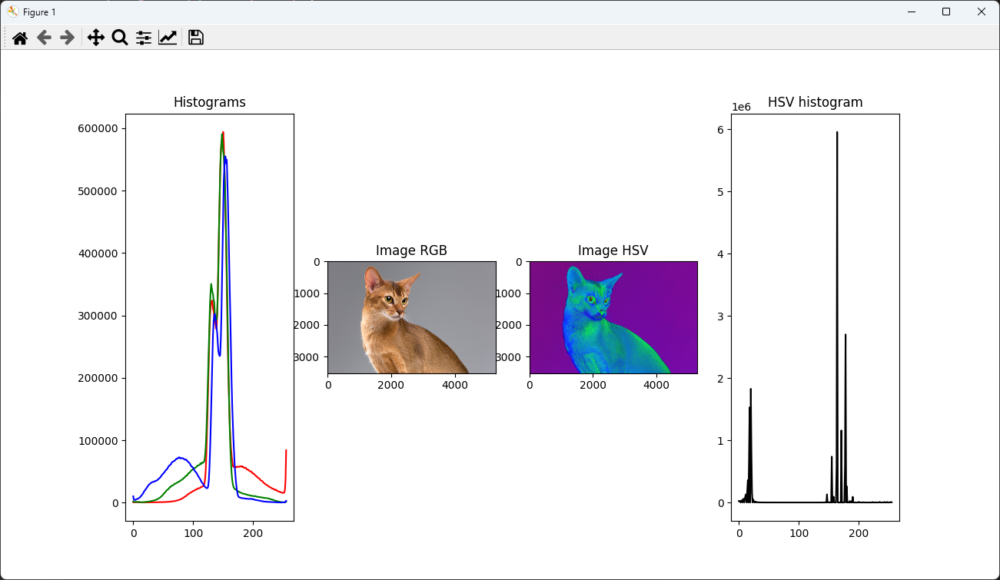
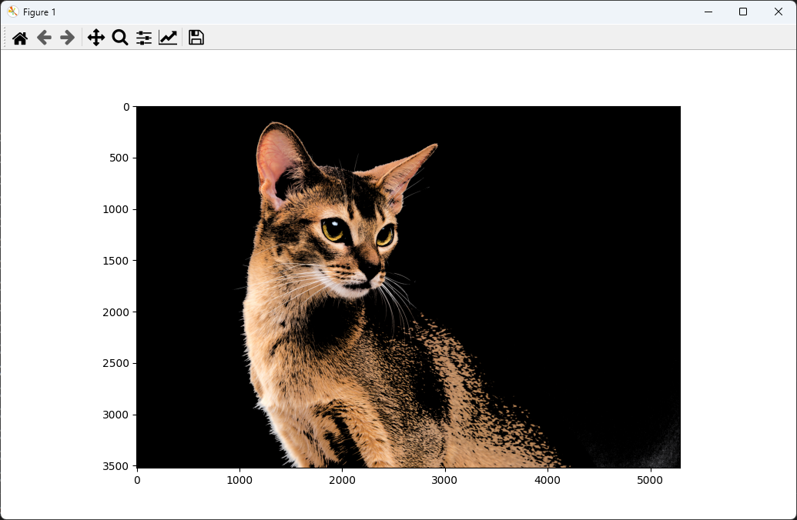
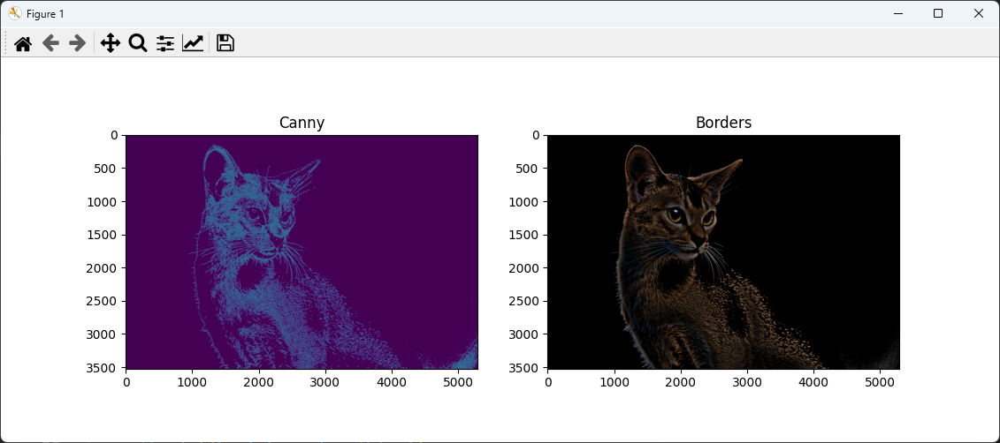

# Аллгоритм выделения границ контрастного объекта на изображении с использованием цветовой гистограммы и порога

## Авторы
Колганов РА

Когтев ВД

Егоров ТМ

Группа: М3О-314Б-21

## Описание

Данный код выполняет следующие операции:

- Загрузка изображения или использование веб-камеры
- Вывод гистограмм изображения в RGB и HSV цветовых моделях
- Обрезка изображения по значению H (из HSV) для удаления фона 
- Применение фильтра Гаусса и детектора границ Кэнни
- Выделение границ методом размытия и вычитания
- Сравнение результатов Кэнни и выделения границ   

## Результаты

### Гистограммы


Гистограммы каналов RGB показывают распределение цветов на изображении. 

Гистограмма H канала в HSV модели также демонстрирует распределение цветов, но в другом цветовом пространстве.

```python
def histograms(img):
    # Получаем гистограмму по каждому из цветов RGB

    # Выводим 3 гистограммы на одном графике

    # Выводим изображение

    # Переводим изображение в HSV

    # Выводим изображение HSV

    # Получаем гистограмму по каждому из цветов HSV

    # Выводим гистограмму HSV

    # Выводим график
```

### Обрезка


Изображение после удаления фона путем обрезки цветов подобранных опытным путем.

```python
def clip(img):
    # Определяем границы опытным путем

    # Делаем все пиксели, которые не попали в границы черными

    # Выводим результат

    # Выводим график

    # Возвращаем результат
```

### Сравнение Кэнни и выделения границ


Слева - результат Кэнни, справа - выделение границ методом размытия по Гауссу и вычитания.

Видно, что оба метода выделяют основные границы, но дают несколько разные результаты.

```python
def gausian_canny(img):
    # Применяем фильтр Гаусса

    # Обнаружение границ с помощью фильтра Кэнни

    # Возвращаем результат

# Выделение границ на изображении
def borders(img, size=301):
    # Применяем фильтр Гаусса

    # Выделяем границы

    # Возвращаем результат

def compare(img1, img2, name1='Image1', name2='Image2'):
    # Выводим изображение 1

    # Выводим изображение 2

    # Выводим график