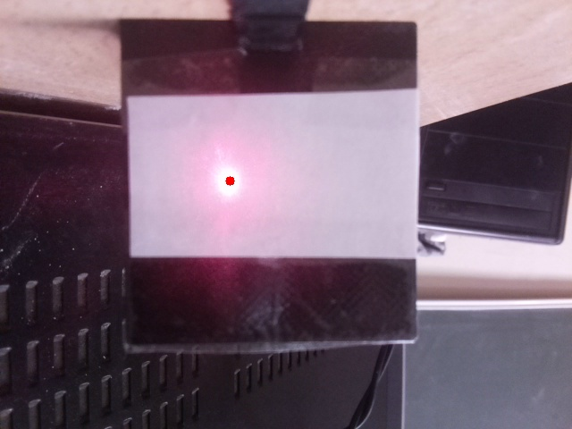

# Алгоритм определения координат лазерной точки на изображении

## Авторы
Колганов РА

Когтев ВД

Егоров ТМ

Группа: М3О-314Б-21

## Необходимые библиотеки

- OpenCV
- Numpy

### Установка библиотек

```bash
pip install opencv-python
pip install numpy
```

## Описание

Данный код на Python выполняет следующие операции:

- Загрузка изображений из папок `imgs` и `USE_WEB_PHOTOS`
- Преобразование изображения в цветовую модель HSV 
- Создание и настройка маски по диапазону значений HSV для выделения лазерной точки
- Применение маски к изображению с помощью битовой операции
- Определение координат центра лазерной точки по выделенным пикселям
- Вычисление статистических характеристик (СКО, стандартное отклонение, радиус разброса) по набору изображений

Для настройки маски используются либо фиксированные значения из словаря maskParams, либо интерактивные ползунки (режим отладки).

## Ключевые функции
```python
def getCenter() # определяет координаты центра лазерной точки на изображении:
# Получает результат применения маски с помощью вызова функции getResult)
# Проходит по всем пикселям, выделяя те, что попали под маску 
# Считает средние координаты X и Y для выделенных пикселей
# Возвращает координаты центра в виде списка [X, Y]
```

```python
def getResult() # применяет маску к изображению и возвращает результат:
# Преобразует изображение в HSV
# Создает маску по заданным параметрам
# Применяет маску с помощью битовой операции
# Возвращает изображение с примененной маской
```

```python
def createTrackbars() # создает интерфейс с ползунками для настройки маски:
# Создает окно OpenCV с названием "mask"
# Добавляет в него ползунки для каждого параметра маски
# Устанавливает начальные значения ползунков
```

```python
def showResult() # выводит изображение с отмеченным центром лазера:
# Рисует красный круг в указанных координатах центра 
# Отображает изображение с нарисованным центром
# Cохраняет изображение в папку Results
```

## Примеры работы алгоритма

### Данные из папки `USE_WEB_PHOTOS`


Исходное изображение `(USE_WEB_PHOTOS/img_0.jpeg)`


Результат работы алгоритма `(Results/result_0.jpg)`

Координаты центра `X: 257, Y: 202`

### Стастистические характеристики
Для набора изображений из папки `USE_WEB_PHOTOS` были вычислены следующие статистические характеристики:

```
Image index 0   X: 257, Y: 202
Image index 1   X: 258, Y: 201
Image index 2   X: 256, Y: 201
Image index 3   X: 257, Y: 202
Image index 4   X: 257, Y: 202
СКО: 1.048528137423857
Стандартное отклонение: [0.48989795 0.63245553]
Радиус разброса: 1.0
```

### Выводы
Полученные статистические характеристики показывают, что алгоритм работает достаточно стабильно, так как СКО и стандартное отклонение малы, а радиус разброса равен одному пикселю.

У 3х из 5 изображений центр лазерной точки определился идентично

## Использование

Необходимо настроить параметры программы в начале файла `main.py`:

```python
DEBUG = False # True - Настройка диапазонов маски с помощью ползунков, False - Использование диапазонов маски из maskParams

USE_WEB = True # True - Использовать фотографии из папки USE_WEB_PHOTOS, False - Использовать фотографии из папки imgs
```

Для запуска программы необходимо запустить файл `main.py` находящийся в корневой папке репозитория (CV)

В случае использования режима отладки (`DEBUG = True`) необходимо настроить параметры маски с помощью ползунков, после чего нажать клавишу `esc` для применения этих параметров и нахождения центра лазерной точки на изображении.

